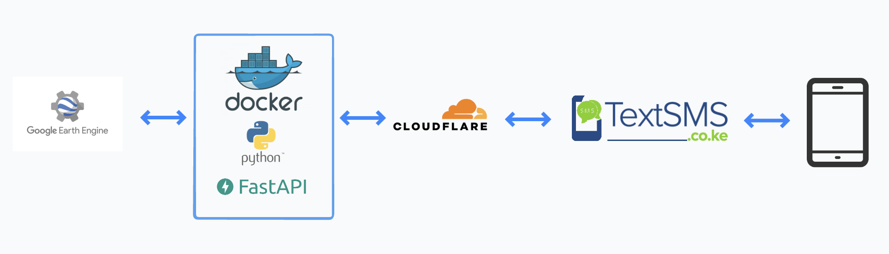

# Grazing Pasture Access for Pastoralists in Kenya

This github contains the full backend codebase for the IEEE GHTC paper, “Using Open Access Remote Sensing to Improve Grazing Access and Reduce Conflict Among Pastoralists in Northern Kenya.”

The backend is structured as follows:



- Google Earth Engine: 
    - For sourcing NDVI images of a user's location
    - For computing mosaics that take the most recent non cloudy data for a given location
    - For creating polygons around areas that have NDVI > 0.3

- Docker:
    - For packaging and containerizing the backend into a server

- Python:
    - For instructing earth engine to create the desired NDVI polygons
    - For managing the API requests and briding Google Earth Engine to the user
    - For compressing the NDVI polygons into SMS message sized data chunks

- FastAPI:
    - For sending and recieving data from the user

- Cloudflare Tunnel:
    - For connecting the TextSMS API to the server

- TextSMS:
    - SMS API for sending and recieving user messages


## Build Docker container

```
make build
```

## Start Docker container
```
make run
```

## License

MIT © Matthew Leopold